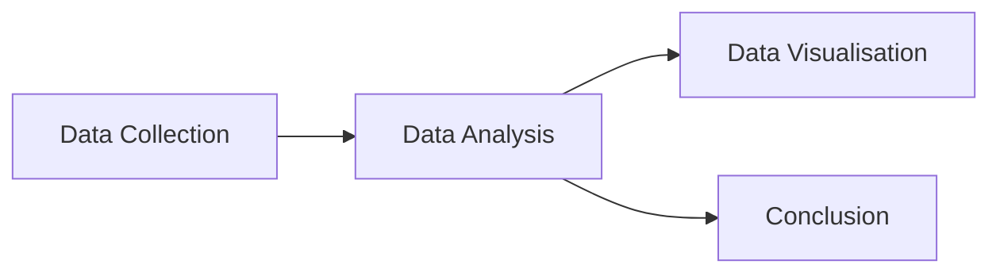

# Learning Guide: Further Websites for Software Projects

This guide walks you through the practical exercises for the workshop.
By the end, you will have a working documentation site for the DinoSoft
library, built with Material for MkDocs and deployed from a Codespace.

## Step 1: Create your repository

1. Go to https://github.com/ImperialCollegeLondon/RCDS-Further-Websites
2. Click the green **Use this template** button, then **Create a new repository**
3. Give it a name (e.g. `my-dinosoft-docs`) and set it to **Public**
4. Click **Create repository**

You now have your own copy of the DinoDiet project with the DinoSoft
Python package included.

## Step 2: Open a Codespace

1. On your new repository page, click the green **Code** button
2. Switch to the **Codespaces** tab
3. Click **Create codespace on main**

Wait for the Codespace to build.

## Step 3: Install MkDocs Material

In the Codespace terminal, run:

```bash
pip install mkdocs-material
```

This installs MkDocs and the Material theme.

## Step 4: Scaffold the docs site

Run the MkDocs scaffolding command:

```bash
mkdocs new .
```

This creates two things:

- `mkdocs.yml` — the configuration file (in the project root)
- `docs/index.md` — a placeholder home page

Open `mkdocs.yml` in the editor. It will contain a minimal default
configuration. (Eventually, you may replace its entire contents with
the reference configuration provided at the bottom of this file)

## Step 5: Move the documentation pages into place

The repository includes pre-written `.md` documentation pages at the root
level. Move them into the `docs/` folder that MkDocs just created, but
leave `README.md` and `LEARNING.md` at the root.

Your project should now look like this:

```
├── dinosoft/
├── tests/
├── docs/
│   ├── index.md
│   ├── ...
├── mkdocs.yml
├── pyproject.toml
├── README.md
├── LEARNING.md
└── LICENSE
└── .gitignore
```

### EXERCISE: Identifying documentation types

The content in each of these files is roughly tied to one of the
following documentation types. Can you identify which is which,
and rename the files to have more appropriate names?

- Tutorials: learning-oriented, guided experiences for newcomers
- How-to guides: task-oriented, solving a specific problem step by step
- Explanation: understanding-oriented, clarifying concepts and design decisions
- Reference: information-oriented, exhaustive technical details of your API
- Quickstarts: minimal, step-by-step setup to get running fast
- Examples: small, single-feature demos with copy-pasteable code
- Templates: full production-ready starter projects for real-world use


## Step 6: Serve the site locally

Start the live preview server:

```bash
mkdocs serve --livereload
```

A notification should appear offering to open the preview in your
browser. Click **Open in Browser** (or go to the **Ports** tab and
click the world icon).

You should see your documentation site rendered with the Material theme.
The pages will have their content but look fairly plain — just headings,
paragraphs, code blocks, and tables.

Leave `mkdocs serve` running. It watches for file changes and
automatically reloads the browser when you save.

## Step 7: Start improving the docs

Open any of the Markdown files in `docs/`. You will find comments
throughout, marked with `<!-- TODO: ... -->`, suggesting Material for
MkDocs features you can add. These comments are invisible in the
rendered site but visible in the editor.

Work through them at your own pace. A good order to try:

### 7a. Configure the theme (mkdocs.yml)

Open `mkdocs.yml` and start adding features. Try these first:

1. Add a light/dark colour palette toggle under `theme:`
2. Enable `content.code.copy` so code blocks get a copy button
3. Enable `navigation.tabs` to turn the top-level nav into tabs

Each time you save `mkdocs.yml`, the preview will reload with
your changes. Use the reference at the bottom of this file
for help.

### 7b. Add admonitions (callout boxes)

In `mkdocs.yml`, add the `admonition` and `pymdownx.details` extensions
under a new `markdown_extensions:` section.

Then open `docs/quickstart.md` and convert the plain-text prerequisites
note into:

```markdown
!!! note "Prerequisites"

    You need **Python 3.10** or later. Check your version with:

    `python --version`
```

Save and check the preview. Try other types: `tip`, `warning`,
`question`, `success`, `danger`, `example`.

Make some collapsible with `???` instead of `!!!`.

### 7c. Add code annotations

In `mkdocs.yml`, enable `content.code.annotate` under `theme: features:`
and add the `pymdownx.highlight` extension.

Then in any code block, add numbered annotations:

````markdown
```python
data = load_sample_data()  # (1)!
```

1. This loads the built-in dataset of 7 dinosaur species.
````

### 7d. Add content tabs

Add `pymdownx.tabbed` (with `alternate_style: true`) to your extensions.
Then in `docs/how-to.md`, convert the test suite section into tabs:

```markdown
=== "With pytest"

    ```bash
    python -m pytest tests/ -v
    ```

=== "Without pytest"

    ```bash
    python -m doctest dinosoft/models.py -v
    ```
```

### 7e. Add a Mermaid diagram

Add `pymdownx.superfences` with the mermaid custom fence to your
extensions. Then in `docs/explanation.md`, replace the ASCII pipeline
with:

````markdown

````

### 7f. Add MathJax formulas

Add `pymdownx.arithmatex` (with `generic: true`) to your extensions,
and add MathJax to `extra_javascript`. Then in `docs/explanation.md`,
replace the plain-text formula with:

```markdown
$$
\text{HF} = \sqrt{(\text{food_kg_per_day})^2}
$$
```

### 7g. Add icons and emoji

Add `pymdownx.emoji` to your extensions with the `twemoji` index.
Then try adding icons to your page headings:

```markdown
# :material-rocket-launch: Quickstart
```

### 7h. Set up auto-generated API docs

Install mkdocstrings:

```bash
pip install 'mkdocstrings[python]'
```

Add it as a plugin in `mkdocs.yml`. Then open `docs/reference/api.md`
and follow the TODO comment to replace the manual reference with
auto-generated docs from your Python docstrings.

### 7i. Add a grid of cards to the home page

Enable `attr_list` and `md_in_html` extensions, then replace the
bullet list on `docs/index.md` with a card grid. See the TODO comment
in that file for guidance.

## Step 8: Deploy to GitHub Pages

Now let's publish your documentation site so anyone can view it.

### 8a. Create the GitHub Actions workflow

1. Go to the Material for MkDocs publishing guide:
   https://squidfunk.github.io/mkdocs-material/publishing-your-site/
2. Find the GitHub Actions workflow YAML under the **GitHub Actions** section
3. Create a new file at `.github/workflows/docs.yml` and paste the
   workflow from the Material for MkDocs documentation into it

### 8b. Configure repository permissions

Before the workflow can deploy, you need to give Actions permission
to write to your repository:

1. Go to your repository on GitHub (not the Codespace)
2. Click **Settings** (the tab along the top)
3. In the left sidebar, expand **Actions** and click **General**
4. Scroll down to **Workflow permissions**
5. Select **Read and write permissions**
6. Click **Save**

### 8c. Enable GitHub Pages

Still in your repository settings:

1. In the left sidebar, click **Pages**
2. Under **Source**, set the **Branch** to `gh-pages`
3. Click **Save** (if prompted)

### 8d. Commit and push everything

Back in your Codespace, commit all your work, using the Source Control
panel in the left sidebar:

1. Write a message
2. Stage your files with `+`
3. Click Commit
4. Click Sync

### 8e. Watch it deploy

1. Go to your repository on GitHub
2. Click the **Actions** tab
3. You should see your workflow running — wait for it to complete
   (this usually takes 1–2 minutes)
4. Once it finishes with a green tick, go to **Settings > Pages**
5. You will see a link to your live site, something like:
   `https://your-username.github.io/my-dinosoft-docs/`

Click the link — your documentation site is now live on the internet.
Every time you push changes to `main`, the site will automatically
rebuild and redeploy.

## Step 9: Keep exploring

There is more you can do:

- Add front matter to pages (title, description, icon, status)
- Enable task list checkboxes with `pymdownx.tasklist`
- Add footnotes, definition lists, and abbreviation tooltips
- Set up a `nav:` section in `mkdocs.yml` with grouped tabs
- Create a GitHub Actions workflow to deploy automatically
  (see `docs/templates.md` for a ready-made workflow)

The finished version of these docs (with all Material features applied)
is available from your instructor for reference.

---

## Reference: mkdocs.yml starter configuration

Replace the contents of your `mkdocs.yml` with the following. This is a
minimal working configuration — the TODO comments guide you through
adding more features as you work through the exercises above.

```yaml
site_name: DinoSoft Documentation
site_description: Documentation for the DinoSoft dinosaur dietary analysis library
repo_url: https://github.com/YOUR-USERNAME/YOUR-REPOSITORY-NAME
repo_name: YOUR-REPOSITORY-NAME

theme:
  name: material
  # TODO: Add a palette section with light/dark toggle
  #   See: https://squidfunk.github.io/mkdocs-material/setup/changing-the-colors/
  # TODO: Add features like navigation.tabs, navigation.top, content.code.copy,
  #   content.code.annotate, search.suggest, search.highlight
  #   See: https://squidfunk.github.io/mkdocs-material/setup/setting-up-navigation/
  # TODO: Add a custom font pairing
  #   See: https://squidfunk.github.io/mkdocs-material/setup/changing-the-fonts/
  # TODO: Add custom admonition icons
  #   See: https://squidfunk.github.io/mkdocs-material/reference/admonitions/#admonition-icons

plugins:
  - search
  # TODO: Add mkdocstrings plugin for auto-generated API reference
  #   pip install 'mkdocstrings[python]'
  #   See: https://mkdocstrings.github.io/

# TODO: Add markdown_extensions section. Useful extensions include:
#   - admonition                  (callout boxes: !!! note, !!! warning, etc.)
#   - pymdownx.details            (collapsible callouts: ??? note)
#   - pymdownx.superfences        (fenced code blocks + mermaid diagrams)
#   - pymdownx.highlight          (syntax highlighting with line numbers)
#   - pymdownx.tabbed             (content tabs: === "Tab 1")
#   - pymdownx.tasklist           (checkbox task lists)
#   - pymdownx.arithmatex         (LaTeX math rendering)
#   - pymdownx.emoji              (icons and emojis: :material-dinosaur:)
#   - attr_list + md_in_html      (grids and cards)
#   - footnotes                   (footnote references)
#   - def_list                    (definition lists for API docs)
#   - abbr                        (abbreviation tooltips)
#   - pymdownx.keys               (keyboard key rendering: ++ctrl+c++)
#   - pymdownx.mark               (highlighted text: ==marked==)
#   - pymdownx.caret              (superscript: ^text^)
#   - pymdownx.tilde              (subscript and strikethrough: ~text~)
#   See: https://squidfunk.github.io/mkdocs-material/setup/extensions/

# TODO: Add extra_javascript for MathJax if using pymdownx.arithmatex
# TODO: Add extra section with social links and custom page statuses

# TODO: Consider a nav to group into sections for navigation.tabs:
# nav:
#   - Getting Started:
#     - Quickstart: quickstart.md
#   - Learning:
#     - Tutorial: tutorial.md
#     - How-to: how-to.md
#   etc.
```
